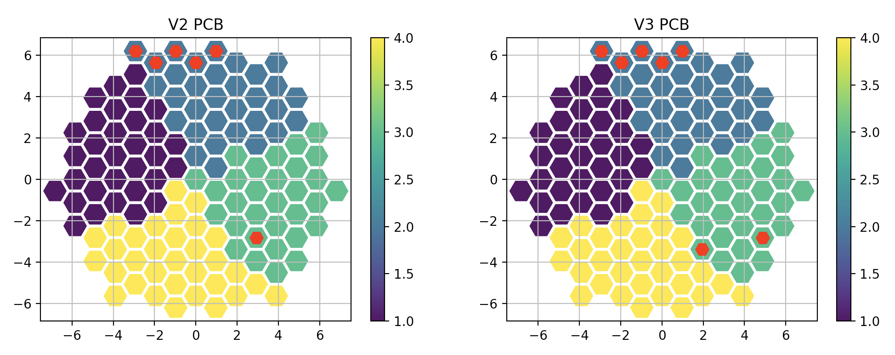
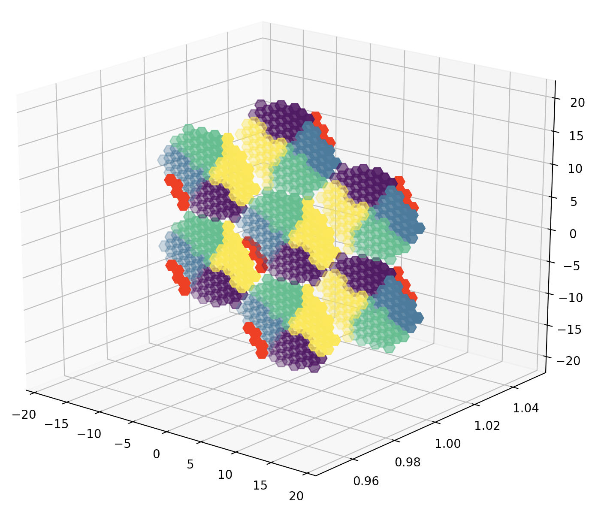

# HGCAL test beam emaps creator

This tool allows to create electronic maps (emaps) compatible with the [CMS-HGCAL/TestBeam](https://github.com/CMS-HGCAL/TestBeam) framework based on simple JSON configuration files.

## Basic emaps

The tool is based on the basic emaps for the different PCB versions. These text files are located in the `basemaps` folder and correspond to the orientation of a module facing up with the HDMI + USB connectors on the top.

## JSON file description

The JSON configuration file for the module layout is based on the following unit representing a single module:

```json
[  
  { 
    "ID": 01,
    "layer": 1,
    "subdet": "EE",
    "pcb_version": "v3",
    "facing": "front",
    "angle": -120,
    "module_IX": 0,
    "module_IV": 0,
    }
]
```

The fields correspond to the columns in the emap + additional information which could be useful, e.g. the subdetector type.

Additional modules can be just added as separated by commas.

## Usage

### Testing
The script `test_emap.py` allows to plot the cells corresponding to the basic v2 and v3 PCB emaps:
```bash
python test_emap.py
```



*Note*: colors correspond to chip numbers, the red cells indicate channels under the HDMI connector and some of those different in v2 and v3


### Displaying

The scripts `display_emap_2d/3d.py` allow to plot the cells corresponding to the emap in 2D or 3D:
```bash
python display_emap_2d/3d.py path/to/file.json
```

3D display example for 1 FH layer:
(*Note*: the red cells indicate channels under the HDMI connector)



### EMAP writer
The main script is `write_emap.py` and can be executed as: 
```bash
python write_emap.py json_emap.json 
```

## Requirements
The tool is based on python and requires the `json`,`numpy`, and `pandas` packages.
